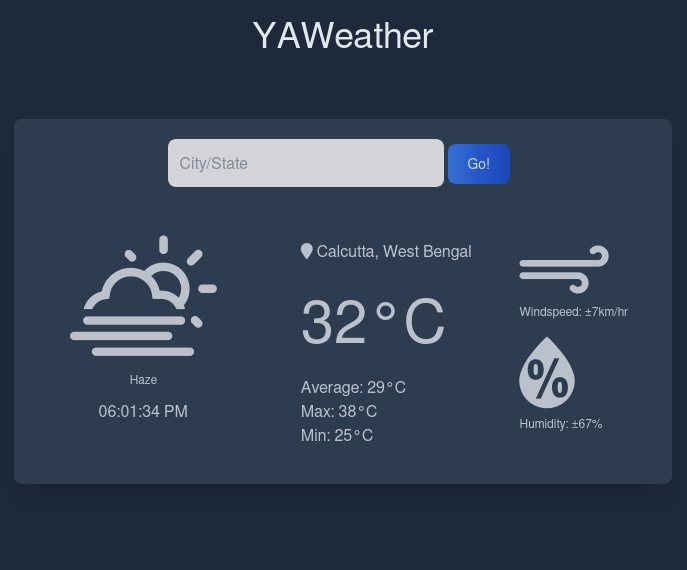

# YAWeather - YetAnotherWeather-JS-webapp



The second YA application backed using vanila `JS` wrapper of [wttr](https://wttr.in), the right way to check the weather!

## Motivation
To strengthen the fundamentals of web development and web based technologies. Collaboration was also a core factor to consider since this project taught me to collaborate with other fellow developers.
>Huge shoutout to [Riya](https://www.github.com/buna26) for contributing weather specific codes to help map weather icon.

## Behind the Scene
For front end, this application uses   tailwindcss. TailwindCSS makes styling easier and intuitive reducing the time it takes to write the front end. The backend uses vanilla JS for DOM manipulation. [wttr](https://wttr.in) is used to fetch weather data in JSON. Best part of wttr is that it has a huge list of weather properties in different formats w/o any API limitations or auth keys.

## Dependencies
If you want to add more feature and continue to develop. Please install these dependencies using npm. Node is a d-level dependency and should be installed 

```bash
    npm -i tailwindcss 
```
In the package.json file add this line:
```json
    "scripts": {
    "tailwind": "npx tailwindcss -i ./src/input.css -o ./build/css/style.css --watch"
    }
```
To compile tailwindcss into normal css:
```bash
    npm run tailwind
```

## Authors
- [rd3ka](https://github.com/rd3ka)
- [buna26](https://github.com/buna26)


## Todo
- [x] ~~Add a search location bar~~ *Not functionality yet*
- [x] ~~Add local time~~
- [ ] Add some color and life
- [ ] Deploy
